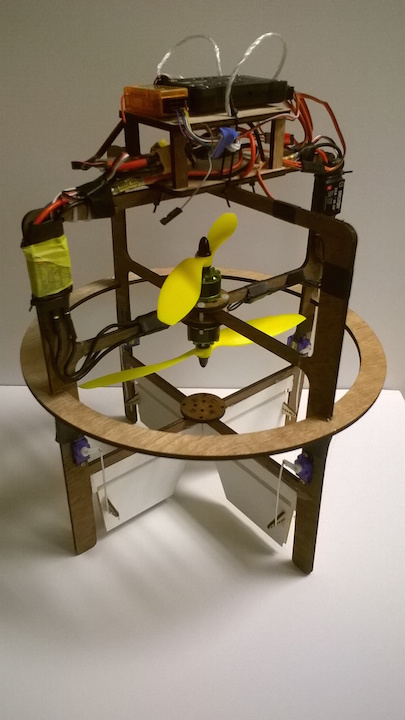
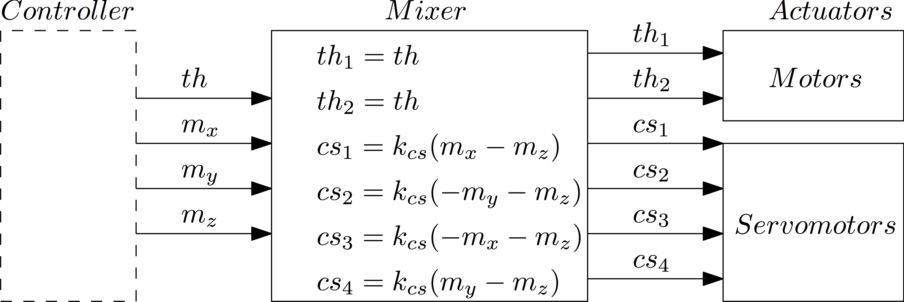

Coaxial-Rotor instructions
==========================

This document presents the main steps to build a flyable coaxial-rotor UAV. 

## Manufactering process
	
The Coaxial-rotor UAV is composed of off-the-shelf electronics parts and plywood / foam-board laser cut parts. The following list of components and CAD files corresponds to a medium-size configuration shown in the following picture. 

Assembled Prototype

### Off the shelf

- PIXHAWK Hardware Autopilot 
- RC receiver: OrangeRx R615X
- Battery : XXX
- ESC (with BEC): 2 x Mystery 30A M-30 with BEC 5V
- Motors: 2 x Multistar 2209-1200 
- Propellers: 2 x 
- 4 servomotors: 4 x Hextronik HXT 500

### Manufactered:
##### Material needed  
- Plywood (6mmm and 3mm)
- Foam-board (6mm)
- Laser-cut machine 
- Hot glue 
- Zip-ties

##### CAD files

This Coaxial-rotor UAV has been designed to be fully laser-cut, and assembled using hot-glue and zip-ties. The CAD files are in the [CAD folder](https://github.com/AubreyC/CoaxialRotor/tree/master/CAD). 
 
###### Plywood 5mm:
- Main Frame: Part 1 (frame_1.SLDPRT) / Part 2 (frame_2.SLDPRT)
- Motor mount: 2 x Part (motorMount.SLDPRT)
- Autopilot Plate: 2 x Part (plate.SLDPRT)
- Column plate: 4 x (columnPlate_long.SLDPRT / columnPlate_short.SLDPRT)

###### Plywood 2.5mm:

- Hinge: 4 x Part (hinge.SLDPRT)

######  Foam-board (6mm):
- Control surfaces: Part 1 (controlSurface_1_v2.SLDPRT) / Part 2 (controlSurface_2_v2.SLDPRT) 
	
__NOTE:__ On the control surface, the second line needs to be scored (and not cut), in order to create a hinge with the foam-board.

##### Laser-cut settings (Epilog Legend 36 EXT)

| Foam-board    | Speed         | Power  | Frequency |
| ------------- |:-------------:| :----: |:---------:|
| Scoring       | 90		    | 100    | 5000		 |		
| Cutting       | 40 	        | 100    | 5000		 |

| Plywood   	| Speed         | Power  | Frequency |
| --------------|:-------------:| :----: |:---------:|
| Cutting (3mm) | 25		    | 	100  | 500	     |		
| Cutting (6mm) | 8  	        |   100  | 500    	 |

## Code base:

For the flight control, the [PX4 flight stack](http://px4.io/) is used for its modularity and clarity as flight control software. 

The devlopment is done under linux [Ubuntu 14.04 LTS](http://releases.ubuntu.com/14.04/). The easiest way to get started is to build a virtual machine using [VirtualBox](https://help.ubuntu.com/community/VirtualBox). 

The PX4 development toolchain needs to be installed. Please follow the instructions: [PX4 flight stack - Installing toolchain](http://dev.px4.io/starting-installing-linux.html).

A lots of additional information can be found in the [PX4 flight stack - Development Guide](http://dev.px4.io). 

### Coaxial-rotor controller

Using the PX4 flight stack allows to re-use most of the code base, and to adapt it for this configuration. 

The coaxial-rotor uses the same controller as a quadcopter, and re-map the output of the controller (forces and torques to apply to the system) to the actuators. The mapping from the output of the attitude controller to the actuators is called the [PX4 flight stack - Mixer](http://dev.px4.io/concept-mixing.html).

For the Coaxial-rotor design, the mixer is designed as shown in the following figure: 

#### Modifications
 
To support this configuration, the following modifications have been made to the base code: 
- __New Start up script__: Start the appropriate modules for this configuration [Start up - Coaxial-rotor](https://github.com/AubreyC/Firmware/blob/coaxial_rotor/ROMFS/px4fmu_common/init.d/15002_coax_rotor)
- __New Mixer__: Map the output of the attitude controller to the actuators. [Mixer - Coaxial-rotor](https://github.com/AubreyC/Firmware/blob/coaxial_rotor/ROMFS/px4fmu_common/mixers/coax_rotor.main.mix)
- __Low pass filter__: Applied on the outputs of the controller / inputs of the mixer (aka forces and torques to apply on the system) [Mixer - Coaxial-rotor](https://github.com/AubreyC/Firmware/blob/coaxial_rotor/src/modules/mc_att_control/mc_att_control_main.cpp)
- __Different attitude gains__: The gains are defined as parameters in the "Attitude Control" section of the parameter list. 

The changes have been incorported in the following version of the PX4 codebase (as a git fork) [PX4 flight stack - Coaxial-rotor version](https://github.com/AubreyC/Firmware/tree/coaxial_rotor) (make sure to select the "coaxial_rotor" branch). 

Clone the git to get a local copy of the code:

	git clone https://github.com/AubreyC/Firmware.git

https://github.com/PX4/Firmware

__NOTE:__ It is possible to start from the official [PX4 flight stack - Github](https://github.com/PX4/Firmware) and to make the modifications manually. In order to do that add: 
- [Start up - Coaxial-rotor](https://github.com/AubreyC/Firmware/blob/coaxial_rotor/ROMFS/px4fmu_common/init.d/15002_coax_rotor) to *Firmware/ROMFS/px4fmu_common/mixers*
- [Mixer - Coaxial-rotor](https://github.com/AubreyC/Firmware/blob/coaxial_rotor/ROMFS/px4fmu_common/mixers/coax_rotor.main.mix) to *Firmware/ROMFS/px4fmu_common/init.d*
- Add the low-pass filter to the Attitude Controller outputs: *Firmware/blob/coaxial_rotor/src/modules/mc_att_control/mc_att_control_main.cpp*

#### Building and configuring

Follow the instructions from the [PX4 flight stack - Building the code](http://dev.px4.io/starting-building.html).

Open a console and navigate to the *Firmware* folder of the code.

Building: 

	make px4fmu-v2_default

Building and uploading: 

	make px4fmu-v2_default upload

Once the code is uploaded on the PIXHAWK, some parameters need to be changed for the coaxial-configuration: 
- SYS_AUTOSTART: set it to __15002__ which corresponds to the custom start-up script.
- Attitude Gains: Gains are proposed as a start but are probably not optimal. It is recommended to tune them for better performances. 

###### Proposed Gains: 
	MC_ACRO_P_MAX	360.0
	MC_ACRO_R_MAX	360.0
	MC_ACRO_Y_MAX	360.0
	MC_PITCHRATE_D	0.0015
	MC_PITCHRATE_FF	0.0000
	MC_PITCHRATE_I	0.03
	MC_PITCHRATE_MAX 220.0
	MC_PITCHRATE_P	0.075
	MC_PITCH_P	3.25
	MC_PITCH_TC	0.16
	MC_RATT_TH	1.00
	MC_ROLLRATE_D	0.0015
	MC_ROLLRATE_FF	0.0000
	MC_ROLLRATE_I	0.025
	MC_ROLLRATE_MAX	220.0
	MC_ROLLRATE_P	0.075
	MC_ROLL_P	3.25
	MC_ROLL_TC	0.16
	MC_YAWRATE_D	0.00
	MC_YAWRATE_FF	0.0000
	MC_YAWRATE_I	0.00
	MC_YAWRATE_MAX	200.0
	MC_YAWRATE_P	0.10
	MC_YAWRAUTO_MAX	45.0
	MC_YAW_FF	0.50
	MC_YAW_P	1.40

__NOTE:__ The [Parameter file](https://github.com/AubreyC/CoaxialRotor/blob/master/parameters/parameters_PX4_CoaxialRotor.params), from one flying prototype has been saved. This file contains the attitude gains, as well as the system start-up number for the coaxial-rotor configuration. Be carefull, this parameter file also contains all the calibration data, which are different from one system to the other. 

